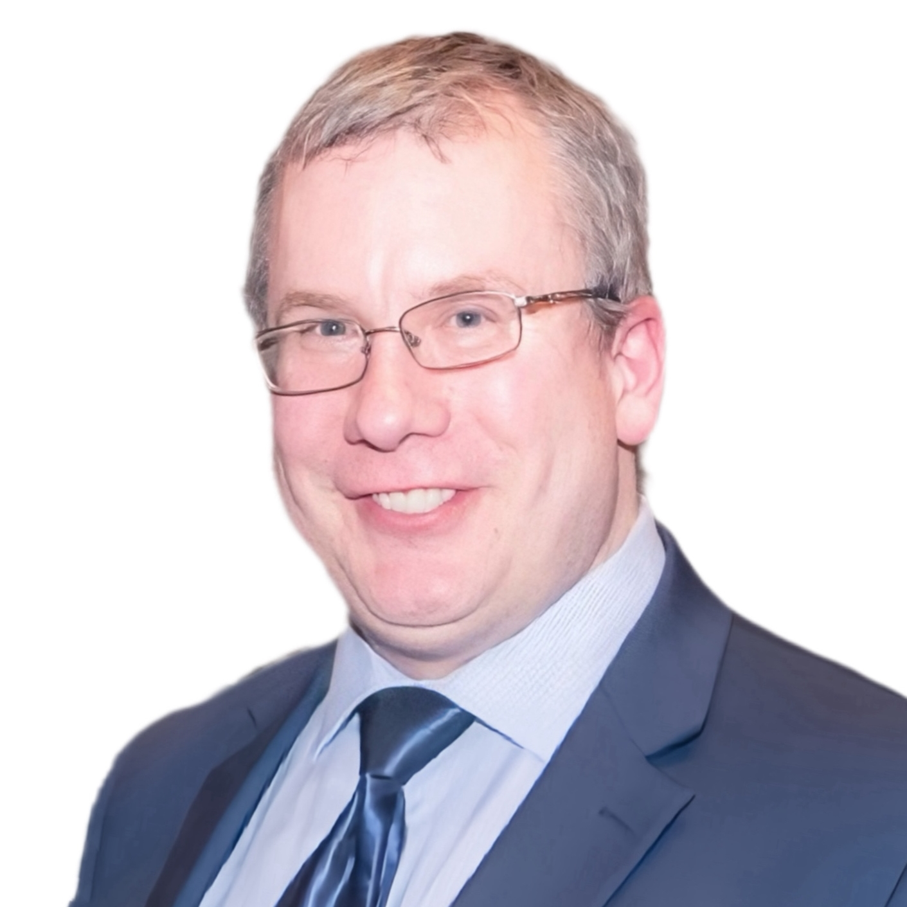

# 本所移民业务介绍

## 本所简介

顶誉律师行(Jade Sunrise Law)，前身为张红倩律师事务所，由阿尔伯塔省律师张红倩于 2016 年 1 月创立。作为一家能够用中英文提供高质量法律服务的律师事务所，我们的目标是扎根专业，以客户需求为导向，为阿省及全国客户提供卓越的双语法律服务。

我们团队经验丰富，能够在多项法律领域为您提供服务。我们的业务范围包括公司法和商业法、民商事诉讼、家庭法、房地产法、移民法、遗嘱、财富传承以及公证服务。

目前，我们在卡尔加里和埃德蒙顿两地设有办公室。

## 移民法业务

在顶誉律师行，我们的专业移民团队致力于为客户提供全面的法律支持，帮助他们应对移民法的复杂性。我们理解移民过程充满挑战，而每个客户的情况又都是独特的。我们的团队为客户量身定制移民方案，努力帮助客户实现他们的移民目标。

我们的移民法服务包括但不限于:

- <i style="font-size: 1.2em; color: teal; font-weight: 500" class="fa-regular fa-address-card"> 临时居留</i>

      ---

      我们协助客户获得临时居留许可，包括访问签证、学习许可和工作许可，指导他们完成申请过程并确保符合所有必要要求。

- <i style="font-size: 1.2em; color: teal; font-weight: 500" class="fa-regular fa-address-card"> 永久居留</i>

      ---

      我们帮助客户通过各种项目申请永久居留，如快速 通道、省提名计划和家庭担保，确保他们的申请完整且准确反映他们的资格。

- <i style="font-size: 1.2em; color: teal; font-weight: 500" class="fa-regular fa-address-card"> 公民身份</i>

      ---

      我们指导客户申请加拿大公民身份，帮助他们准备公民测试并在申请过程中提供法律支持。

- <i style="font-size: 1.2em; color: teal; font-weight: 500" class="fa-regular fa-address-card"> 商业移民</i>

      ---

      我们协助企业家和投资者了解各种商业移民计划，帮助他们在加拿大创立或投资企业，并获得必要的许可和签证。

- <i style="font-size: 1.2em; color: teal; font-weight: 500" class="fa-regular fa-address-card"> 家庭团聚</i>

      ---

      我们协助客户通过担保过程与加拿大的家庭成员团聚，解决可能出现的任何法律问题。

- <i style="font-size: 1.2em; color: teal; font-weight: 500" class="fa-regular fa-address-card"> 难民和庇护申请</i>

      ---

      我们的律师代表客户进行难民和庇护申请，提供法 律支持并在整个过程中为他们辩护。

- <i style="font-size: 1.2em; color: teal; font-weight: 500" class="fa-regular fa-address-card"> 移民上诉和司法审查</i>

      ---

      我们代表客户进行移民上诉和司法审查，挑战不利决定并努力获得成功的结果。

- <i style="font-size: 1.2em; color: teal; font-weight: 500" class="fa-regular fa-address-card"> 合规和执法</i>

      ---

      我们帮助客户确保遵守移民法律法规，就诸如不予准入、驱逐令和拘留审查等问题提供咨询。

## 团队成员

- **张红倩律师(Kathy Zhang)**

      ---

      

      张红倩律师，毕业于中国顶级法学院，并获得香港大学普通法硕士学位和加拿大达尔豪斯大学法学硕士学位。张律师曾在深圳市中级人民法院担任法官，审理商事和民事纠纷。

      张律师是加拿大为数极少的在中加两地均具有多年工作经验的律师，尤其是她在中国担任法官职务的经历让她具有成熟的法律思维，可以从司法裁决者的视角分析法律问题，具有极强的解决复杂法律问题的能力，是阿尔伯塔少有的能为您提供中加跨境法律服务的资深律师。

- **Russ Weninger 律师**

      ---

      

      Russ Weninger 律师，毕业于加拿大历史最悠久的法学院之一， Dalhousie 法学院，是加拿大阿尔伯塔省资深移民法律师。Russ 律师在卡尔加里执业多年，曾多次担任律师协会移民法分会负责人，业务领域覆盖从移民申请到上诉和联邦法院司法复查。

      他多次受邀给律师同行、市政府和司法部门进行法律培训和业务指导，Russ 律师丰富的移民法执业经验和敬业的工作态度使他成为卡尔加里最受欢迎的移民法律师之一。

- **关馨律师**

      ---

      

      关馨律师拥有中国法律硕士学位，曾任职于一家大型跨国企业法律部多年，拥有丰富的工作经验和卓越的客户沟通能力。

      关律师自2017年加盟顶誉律师行，目前负责事务所移民相关事务，以及涉及中加两地的国际公证认证业务。经过多年的工作理解，关律师与各级政府部门建立了良好的工作关系，已协助数千客户完成了移民及公证认证工作。

- **崔肖龙**

      ---

      

      崔肖龙本科就读于北京大学法律系;研究生就读于加拿大多伦多大学。崔肖龙持有中国内地职业律师证书，在国内从事多年的律师工作，并先后在若干知名企业担任公司法务。

      崔肖龙于2023年5月加入顶誉律师行的团队，目前作为律师助理， 主要协助本所律师提供移民法、房地产及公司法务等方面的支持工作。

- **Sophie Ning**

      ---

      

      本科毕业于吉林大学法学院并获得法学学士学位; 研究生就读于英国杜伦大学并获得法学硕士学位。Sophie Ning持有中国执业律师证书，具有丰富的诉讼/非诉律师经验，并具有中国境内多家大型跨国公司法务工作经验。

      Sophie Ning 目前在顶誉律师行担任律师助理一职，主要协助本所律师提供移民法、家庭法及诉讼等方面的支持工作。

## 预约咨询通道

请添加如下微信二维码，预约律师咨询。

 <!--  -->

 <!--  -->

<!-- ## 张律师致辞 -->

<!-- 

各位客户和广大网友，大家好！

我们是一家以移民法、商法和婚姻家庭法见长的卡尔加里本地律师事务所。

在多年的移民法律服务过程中，我们深知除了极少数的幸运儿，大部分移民申请人都会经历一个漫长而煎熬的申请过程，而申请人是否能遇到一家专业、尽职的中介机构为移民之旅保驾护航，不仅仅决定了移民过程是否顺遂和高效，更有可能是成功与失败的天壤之别。

我们希望通过扎实的业务和真诚的服务，为申请人量身定制最适合的移民方案，助力您在移民之路上行稳致远，顺利抵达梦想的彼岸。

 -->

## 本所联系方式

顶誉律师行 （Jade Sunrise Law）

**地址:** 500-1110 Centre Street NE Calgary, AB T2E 2R2  
**电话:** [1 (403) 456-3977](tel:14034563977) 
**传真:** [1(844) 272-3932](tel:18442723932) 
**Email:** [info@jadesunriselaw.com](mailto:info@jadesunriselaw.com) 

## 官网改版发布

顶誉律师行（Jade Sunrise Law）的官方网站改版已正式发布！想要访问官网的用户，请移步至[www.jadesunriselaw.com](https://www.jadesunriselaw.com/zh){:target="\_blank"}。

<!--
## 办公地址

按空格键或刷新页面，显示地图

 -->
